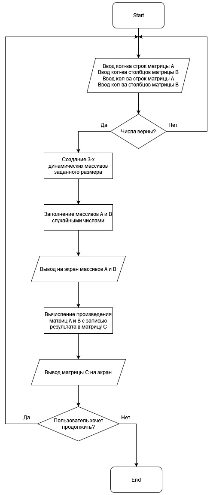
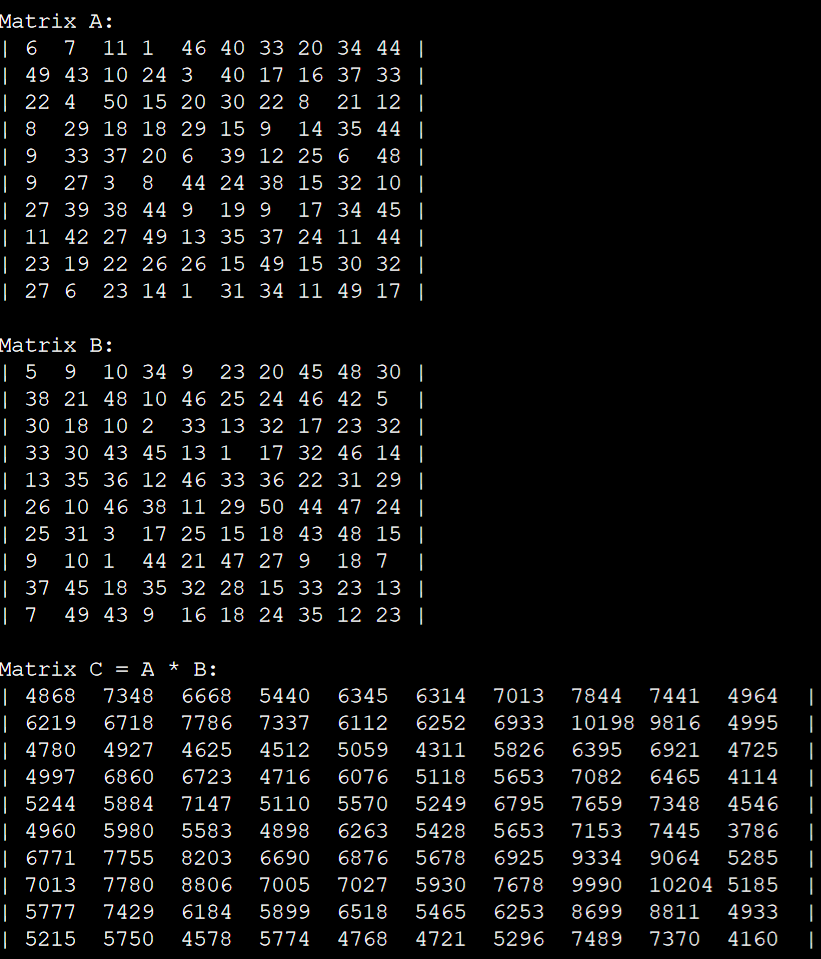
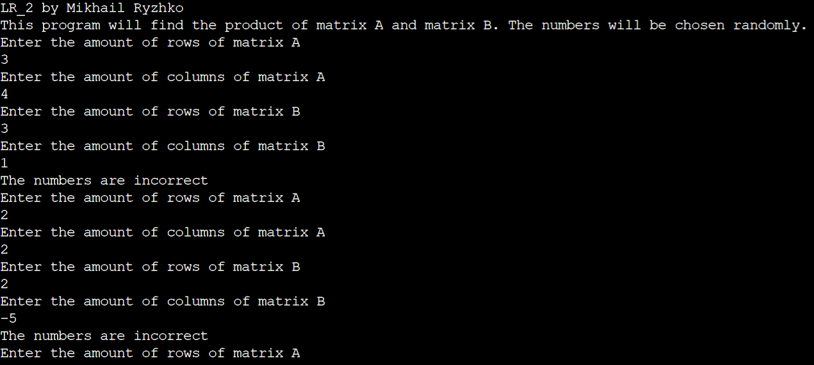

# Общая информатика

## Лабораторная работа №2

### Содержание

1. Задание
2. Блок-схема
3. Текст программы
4. Описание работы программы

### 1. Задание

Сделать программу, вычисляющую произведение двух матриц заданного размера и выводящую результат на экран. Программа должна использовать динамические массивы.

### 2. Блок-схема



### 3. Текст программы

```c++
#include <iostream>  //Библиотека для взаимодействия с полльзователем через консоль
#include <stdlib.h>  //Стандартная библиотека, содержащая функцию псевдослучайной генерации чисел
#include <time.h>  //Библиотека для работы с датой и временем (нужна для инициализации случайной генерации чисел)

using namespace std;

bool restart = true, exitFlag, numberSize;  //Флаги выхода из программы / повторного запуска программы
const char* border = "|";  //Повторяющиеся символы
const char* blank = " ";
int maxNumber = 0;  //Максимальное число цифр вычисляемой матрицы

int numberCounter(int number) {  //Функция считает количество цифр целого числа, которое в неё поступает
    int counter = 0;  //Счётчик цифр
    while (number != 0) {  //Число делится на 10, пока не станет равным нулю, одновременно считается количество произведённых операций
	    number /= 10;
	    counter++;
	}
    return (counter);  //Возврат количества цифр числа
}

void mainProgram() {  //Основная программа
	char restartChar;  //Символ Y/N, считываемый с клавиатуры
	int rNumA, cNumA, rNumB, cNumB;  //Количество строк / столбцов матриц A и B
	cout << "This program will find the product of matrix A and matrix B. The numbers will be chosen randomly." << endl;
	while (numberSize) {  //Запрос количества строк и столбцов матриц A и B с клавиатуры. Запрос повторяется, если введены неправильные числа
	    numberSize = false;
	    cout << "Enter the amount of rows of matrix A" << endl;
	    cin >> rNumA;
	    cout << "Enter the amount of columns of matrix A" << endl;
	    cin >> cNumA;
	    cout << "Enter the amount of rows of matrix B" << endl;
	    cin >> rNumB;
        cout << "Enter the amount of columns of matrix B" << endl;
	    cin >> cNumB;
	    if ((cNumA != rNumB) or (rNumA < 1) or (cNumA < 1) or (rNumB < 1) or (cNumB < 1) or (rNumA > 10) or (cNumA > 10) or (rNumB > 10) or (cNumB > 10)) { //Ограничения по вводу чисел
	        numberSize = true;
	        cout << "The numbers are incorrect" << endl;
	    }
	}
	int **matrix_1 = new int* [rNumA];  //Создание трёх динамических массивов - для матриц A, B, и матрицы C для хранения результата
    int **matrix_2 = new int* [rNumB];
        for (int count = 0; count < rNumB; count++)
            matrix_2[count] = new int [cNumB];
    int **matrix_3 = new int* [rNumA];
        for (int count = 0; count < rNumA; count++) {
            matrix_1[count] = new int [cNumA];
            matrix_3[count] = new int [cNumB];
        }
    cout << endl << "Matrix A:" << endl;  //Заполнение массива A случайными числами и вывод его на экран
    for (int i = 0; i < rNumA; i++) {  //Заполнение строк
        cout << border << blank;  //Создание границы и зазора между границей и первым числом
        for (int j = 0; j < cNumA; j++) {  //Заполнение столбцов
            matrix_1[i][j] = rand() % 50;  //Заполнение ячейки массива случайным числом
            cout <<  matrix_1[i][j];  //Вывод элемента массива на экран
            for (int k = 0; k < (3 - numberCounter(matrix_1[i][j])); k++) cout << blank;  //Добавление пробелов для ровного отображения матрицы
        }
        cout << border << endl; //Создание правой границы массива
    }
    cout << endl << "Matrix B:" << endl;  //Заполнение массива B случайными числами и вывод его на экран
    for (int i = 0; i < rNumB; i++) {  //Заполнение строк
        cout << border << blank;  //Создание границы и зазора между границей и первым числом
        for (int j = 0; j < cNumB; j++) {  //Заполнение столбцов
            matrix_2[i][j] = rand() % 50;  //Заполнение ячейки массива случайным числом
            cout <<  matrix_2[i][j];  //Вывод элемента массива на экран
            for (int k = 0; k < (3 - numberCounter(matrix_2[i][j])); k++) cout << blank;  //Добавление пробелов для ровного отображения матрицы
        }
        cout << border << endl; //Создание правой границы массива
    }
    cout << endl << "Matrix C = A * B:" << endl; //Вычисление произведения матриц A и B
    for (int i = 0; i < rNumA; i++) {
      for (int j = 0; j < cNumB; j++) {
            matrix_3[i][j] = 0;  //Обнуление ячейки массива
            for(int k = 0; k < cNumA; k++) matrix_3[i][j] += matrix_1[i][k]*matrix_2[k][j];  //Вычисление произведения матриц по правилам и запись результата в массив C
            if (maxNumber < numberCounter(matrix_3[i][j])) maxNumber = numberCounter(matrix_3[i][j]);  //Вычисление максимальной длины числа матрицы C для её ровного отображения в дальнейшем
        }
    }
    for (int i = 0; i < rNumA; i++) { //Отображение матрицы C на экране
        cout << border << blank;  //Создание границы и зазора между границей и первым числом
        for (int j = 0; j < cNumB; j++) {
            cout <<  matrix_3[i][j];
            for (int k = 0; k < ((1 + maxNumber - numberCounter(matrix_3[i][j]))); k++) cout << blank;  //Добавление пробелов для ровного отображения матрицы
        }
        cout << border << endl; //Создание правой границы массива
    }
    cout << endl;
    for (int count = 0; count < rNumA; count++) {  //Удаление динамических массивов
        delete [] matrix_1[count];
        delete [] matrix_3[count];
    }
    for (int count = 0; count < rNumB; count++)
        delete [] matrix_2[count];
	while (!exitFlag) {  //Принятие решения пользователем о продолжении выполнения или о прекращении работы программы
	  exitFlag = true;
	  cout << "Do you want to continue? Y/N" << endl;
	  cin >> restartChar;
      if (restartChar == 'Y') restart = true;
	  else if (restartChar == 'N') restart = false;
	  else exitFlag = false;
	}
}

int main() {
	cout << "LR_2 by Mikhail Ryzhko" << endl;
	srand (time(NULL));  //Инициализация генератора псевдослучайных чисел текущим временем для генерации различных чисел при каждом новом запуске программы
	while (restart) {  //Перезапуск программы по желанию пользователя
	    restart = true;
	    exitFlag = false;
	    numberSize = true;
	    mainProgram();  //Запуск основной программы
	}
	return 0;
}
```

### 4. Описание работы программы

Программа написана на языке C++ в онлайн-компиляторе OnlineGDB <https://www.onlinegdb.com/online_c++_compiler>. Для организации ввода-вывода данных использована библиотека iostream, взаимодействие с пользователем реализовано посредством консоли, куда пользователь может вводить исходные данные программы. Пользователь вводит количество строк и столбцов матриц A и B. Для упрощения ввода числа матрицы генерируются случайно. Для этого использована библиотека stdlib.h и библиотека time.h для инициализации генератора псевдослучайных чисел текущим временем. После ввода данных программа проверяет, правильно ли пользователь ввел данные, затем создаёт по заданным условиям три динамических массива для хранения этих матриц и результата их произведения. Далее программа вычисляет произведение матриц A и B по заданным пользователем условиям, записывая результат в матрицу C и выводя её на экран. Динамические массивы удаляются, освобождая оперативную память компьютера. После завершения работы программы в консоли можно увидеть записанные последовательно матрицы A, B и результат их произведения в виде матрицы C. После окончания работы у пользователя спрашивается, хочет ли он продолжить выполнение программы. Если да, то программа запускается заново, если нет, то она завершается.

Результаты работы программы:




