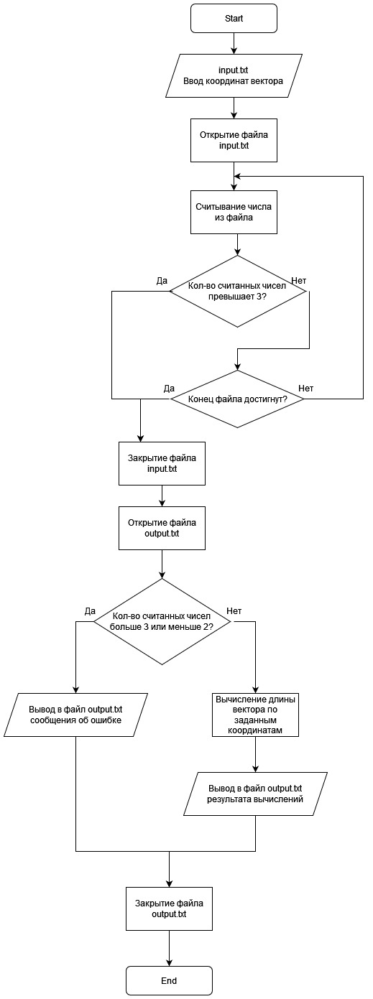
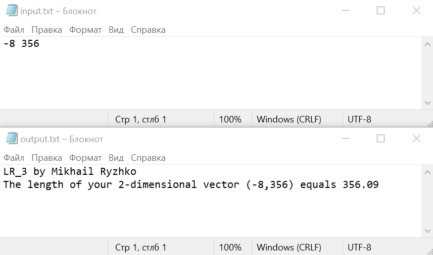
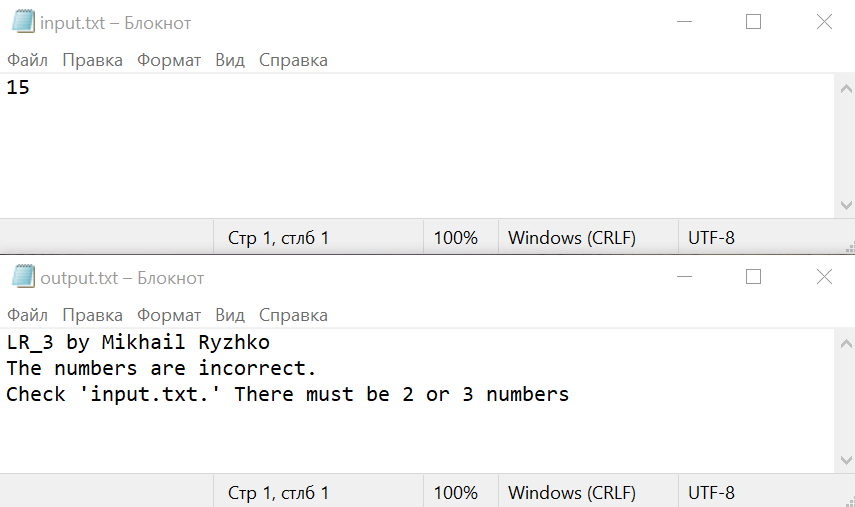
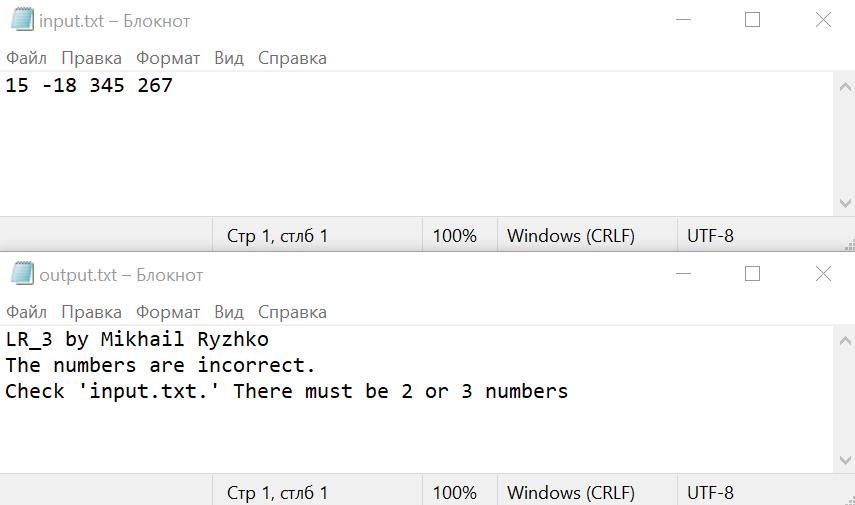

# Общая информатика

## Лабораторная работа №3

### Содержание

1. Задание
2. Блок-схема
3. Текст программы
4. Описание работы программы

### 1. Задание

Сделать программу, вычисляющую длину вектора, координаты которого находятся в файле input.txt и сохраняющую результат в файл output.txt.

### 2. Блок-схема



### 3. Текст программы

```c++
#include <fstream> //Библиотека для работы с файлами

int main() {
    int coords[3], count = 0, sum = 0; //Заданем переменные
	bool exitFlag = false;
    std::ifstream input("input.txt"); // Открываем файл для чтения
    if (input.is_open()) { //Проверяем, открыт ли файл
		while (!input.eof()) { //Пока не достигнут конец файла, считываем координаты
			if (count > 2) { //Если количество координат больше 3-х, то выходим из цикла.
				exitFlag = true; //Указание того, что был числа были введены неправильно
				break;
			}
			input >> coords[count];  //Считываем координаты в массив
			count++;  //Считаем количество считанных координат
		}
    }
    input.close();     // закрываем файл
	std::ofstream output("output.txt"); //Открываем файл для записи результатов
	if (output.is_open()) { //Проверка, открыт ли файл
		output << "LR_3 by Mikhail Ryzhko" << "\n";
		if ((exitFlag) || (count < 2)) { //Если числа были введены неправильно, выводим сообщение об ошибке
			output << "The numbers are incorrect." << "\n" << "Check 'input.txt.' There must be 2 or 3 numbers" << "\n";
		}
		else { //Если числа были введены правильно, считаем длину вектора
			for(int i = 0; i < (count); i++) { //Вычисляем суммы квадратов координат для использования в дальнейшем
				sum += coords[i]*coords[i];
			}
			output << "The length of your "<< (count) << "-dimensional vector ("; //Выводим результата в файл
			for(int i = 0; i < (count); i++) { //Выводим координаты вектора для наглядности результата
				output << coords[i];
				if (i != (count-1)) output << ",";
			}
			output << ") equals " << sqrt(float(sum)); //Выводим результата в файл
			output.close(); //Закрываем файл
		}
	}
	return 0;
}
```

### 4. Описание работы программы

Программа написана на языке C++ в среде разработки Microsoft Visual Studio 2010. Для считывания данных из файла и для записи в файл использована библиотека <fstream>, взаимодействие с пользователем реализовано посредством двух файлов: файла ввода данных, куда пользователь может ввести нужные значения, и файла вывода данных, куда записывается результат программы. Сначала пользователь вводит координаты двухмерного или трехмерного вектора в файл input.txt через пробел и сохраняет файл. Затем запускает программу. Она выполняется, не выводя ничего на экран. Сначала она открывает файл input.txt, считывает из него координаты вектора, одновременно считая их количество (если оно больше заданного, то ситывание прекращается) и закрывает его. Далее открывается файл output.txt, программа сравнивает, соответствует ли количество координат заданным условиям. Если да, то производится вычисление длины вектора и результат выводится в файл. Если нет, то в файл выводится сообщение об ошибке. Файл закрывается и программма завершает свое выполнение. Затем пользователь может посмотреть результат работы программы в файле output.txt.

Результаты работы программы:





	
