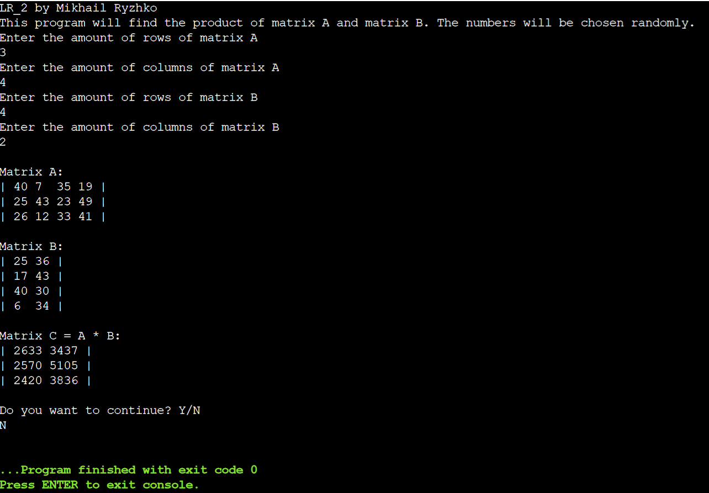
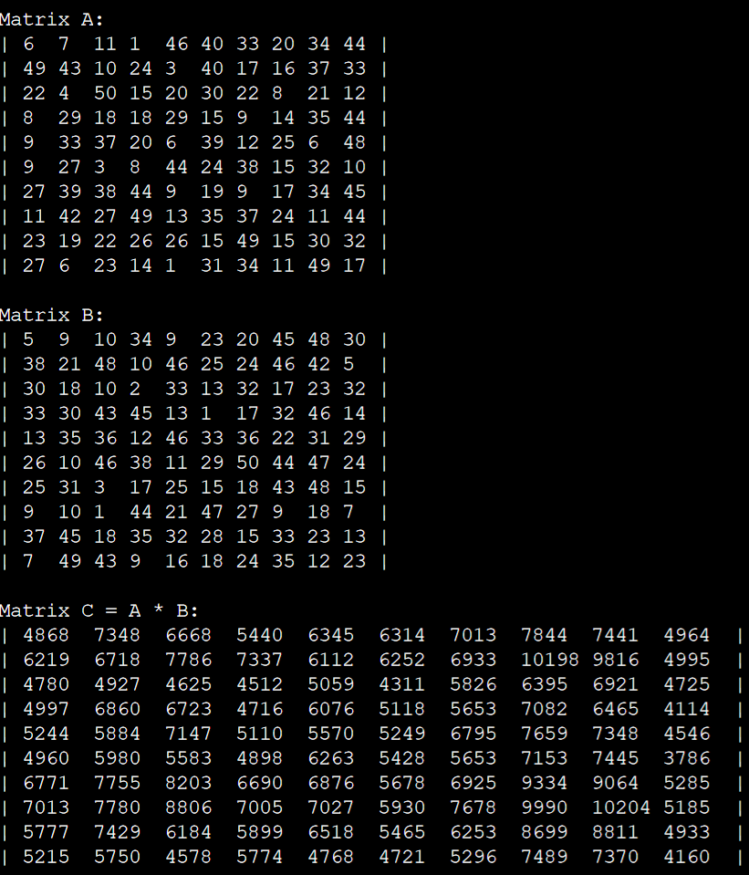
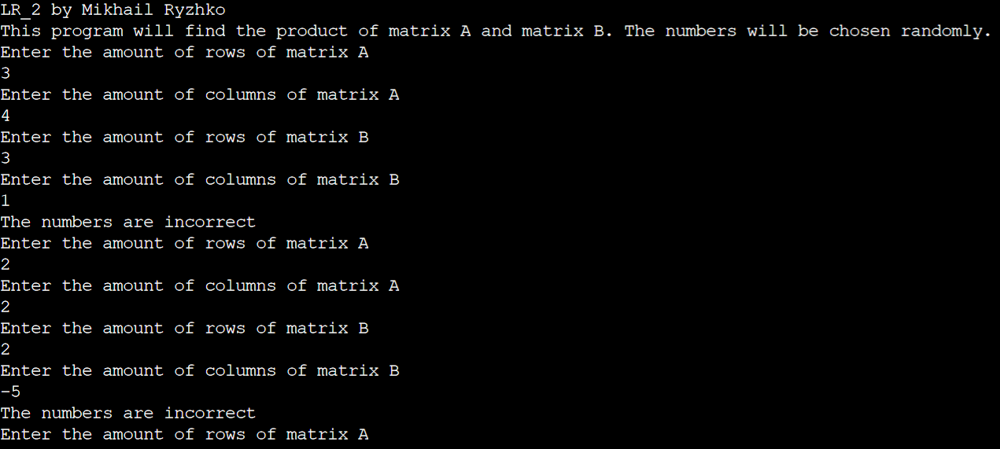

# Общая информатика

## Лабораторная работа №3

### Содержание

1. Задание
2. Блок-схема
3. Текст программы
4. Описание работы программы

### 1. Задание

Сделать программу, вычисляющую произведение двух матриц заданного размера и выводящую результат на экран. Программа должна использовать динамические массивы.

### 2. Блок-схема


### 3. Текст программы

```c++
#include <fstream>

int main() {
    int coords[3], count = 0, sum = 0;
	bool exitFlag = false;
    std::ifstream input("input.txt"); // окрываем файл для чтения
    if (input.is_open())
    {
		while (!input.eof()) {
			if (count > 2) {
				exitFlag = true;
				break;
			}
			input >> coords[count];
			count++;
		}
    }
    input.close();     // закрываем файл
	std::ofstream output("output.txt");
	output << "LR_3 by Mikhail Ryzhko" << "\n";
	if ((exitFlag) || (count < 2)) {
		output << "The numbers are incorrect." << "\n" << "Check 'input.txt.' There must be 2 or 3 numbers" << "\n";
	}
	else {
		for(int i = 0; i < (count); i++) {
			sum += coords[i];
		}
		output << "The length of your "<< (count) << "-dimensional vector (";
		for(int i = 0; i < (count); i++) {
			output << coords[i];
			if (i != (count-1)) output << ",";
		}
		output << ") = " << sqrt(float(sum));
		output.close();
	}
	return 0;
}
```

### 4. Описание работы программы

Программа написана на языке C++ в онлайн-компиляторе OnlineGDB <https://www.onlinegdb.com/online_c++_compiler>. Для организации ввода-вывода данных использована библиотека iostream, взаимодействие с пользователем реализовано посредством консоли, куда пользователь может вводить исходные данные программы. Пользователь вводит количество строк и столбцов матриц A и B. Для упрощения ввода числа матрицы генерируются случайно. Для этого использована библиотека stdlib.h и библиотека time.h для инициализации генератора псевдослучайных чисел текущим временем. После ввода данных программа проверяет, правильно ли пользователь ввел данные, затем создаёт по заданным условиям три динамических массива для хранения этих матриц и результата их произведения. Далее программа вычисляет произведение матриц A и B по заданным пользователем условиям, записывая результат в матрицу C и выводя её на экран. Динамические массивы удаляются, освобождая оперативную память компьютера. После завершения работы программы в консоли можно увидеть записанные последовательно матрицы A, B и результат их произведения в виде матрицы C. После окончания работы у пользователя спрашивается, хочет ли он продолжить выполнение программы. Если да, то программа запускается заново, если нет, то она завершается.

Результаты работы программы:




