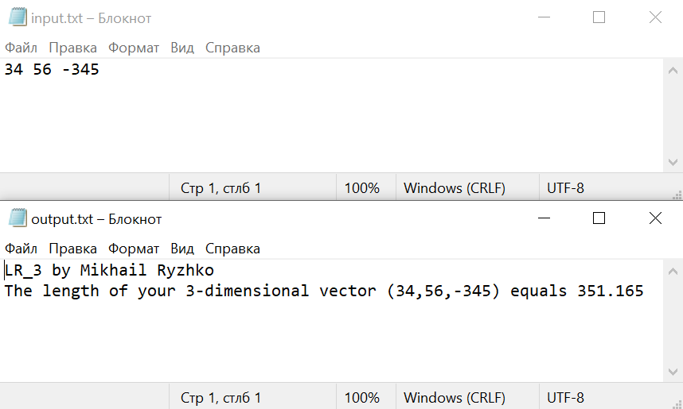

# Общая информатика

## Лабораторная работа №3 (Не закончена)

### Содержание

1. Задание
2. Блок-схема
3. Текст программы
4. Описание работы программы

### 1. Задание

Сделать программу, вычисляющую длину вектора, координаты которого находятся в файле input.txt и сохраняющую результат в файл output.txt.

### 2. Блок-схема


### 3. Текст программы

```c++
#include <fstream>

int main() {
    int coords[3], count = 0, sum = 0;
	bool exitFlag = false;
    std::ifstream input("input.txt"); // окрываем файл для чтения
    if (input.is_open())
    {
		while (!input.eof()) {
			if (count > 2) {
				exitFlag = true;
				break;
			}
			input >> coords[count];
			count++;
		}
    }
    input.close();     // закрываем файл
	std::ofstream output("output.txt");
	output << "LR_3 by Mikhail Ryzhko" << "\n";
	if ((exitFlag) || (count < 2)) {
		output << "The numbers are incorrect." << "\n" << "Check 'input.txt.' There must be 2 or 3 numbers" << "\n";
	}
	else {
		for(int i = 0; i < (count); i++) {
			sum += coords[i]*coords[i];
		}
		output << "The length of your "<< (count) << "-dimensional vector (";
		for(int i = 0; i < (count); i++) {
			output << coords[i];
			if (i != (count-1)) output << ",";
		}
		output << ") equals " << sqrt(float(sum));
		output.close();
	}
	return 0;
}
```

### 4. Описание работы программы

Программа написана на языке C++ в среде разработки Microsoft Visual Studio 2010. Для считывания данных из файла и для записи в файл использована библиотека <fstream>, взаимодействие с пользователем реализовано посредством двух файлов: файла ввода данных, куда пользователь может ввести нужные значения, и файла вывода данных, куда записывается результат программы. Сначала пользователь вводит координаты двухмерного или трехмерного вектора в файл input.txt через пробел и сохраняет файл. Затем запускает программу. Она выполняется, не выводя ничего на экран. Сначала она открывает файл input.txt, считывает из него координаты вектора, одновременно считая их количество (если оно больше заданного, то ситывание прекращается) и закрывает его. Далее открывается файл output.txt, программа сравнивает, соответствует ли количество координат заданным условиям. Если да, то производится вычисление длины вектора и результат выводится в файл. Если нет, то в файл выводится сообщение об ошибке. Файл закрывается и программма завершает свое выполнение. Затем пользователь может посмотреть результат работы программы в файле output.txt.

Результаты работы программы:




	
